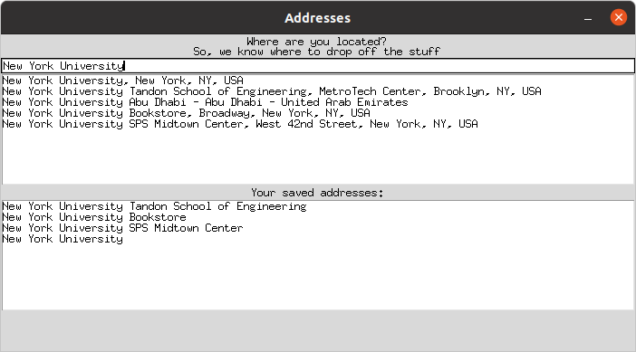

# Addresses

## Installation

```
conda create --name Addresses python=3.8
conda activate Addresses
```

You should create a local file called `api-key.txt` containing your API key to 
the Google Maps API. The file `api-key.txt` is in the `.gitignore` list.

## Usage

```
python addresses.py
```



Search the address within the allowed zip codes.
Only addresses within the allowed zip codes are saved.
The other addresses are discarded.

Click the recommended addresses to save them.

Once saved, you can delete the address with the Backspace key.
